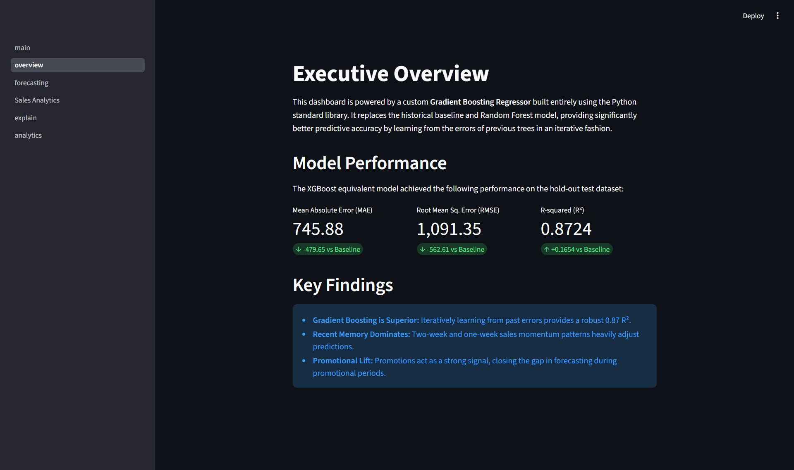
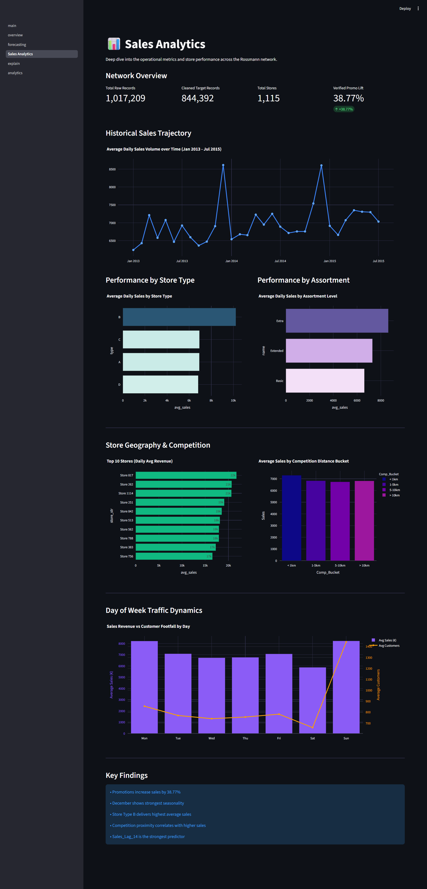
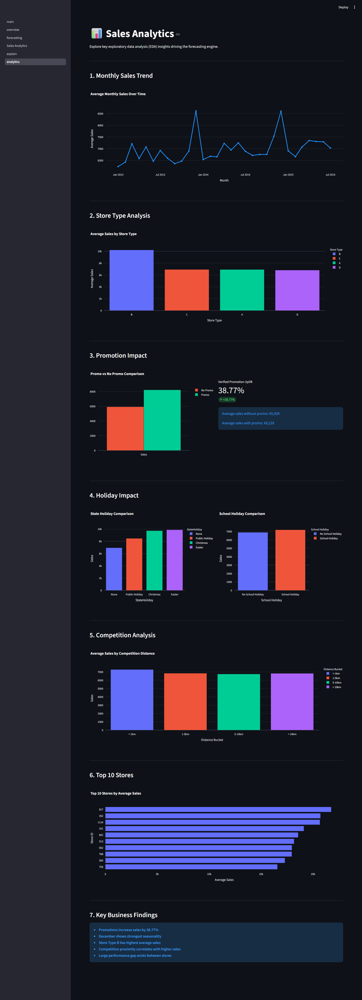
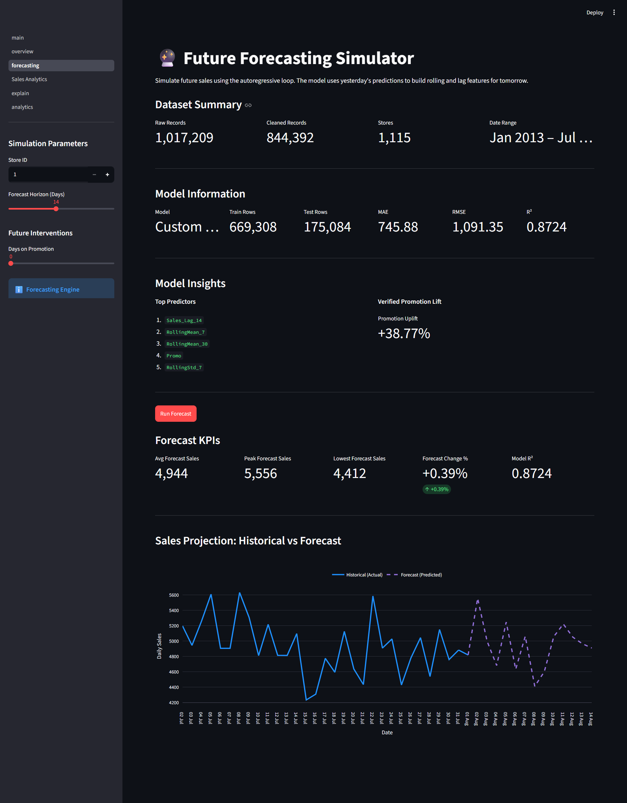
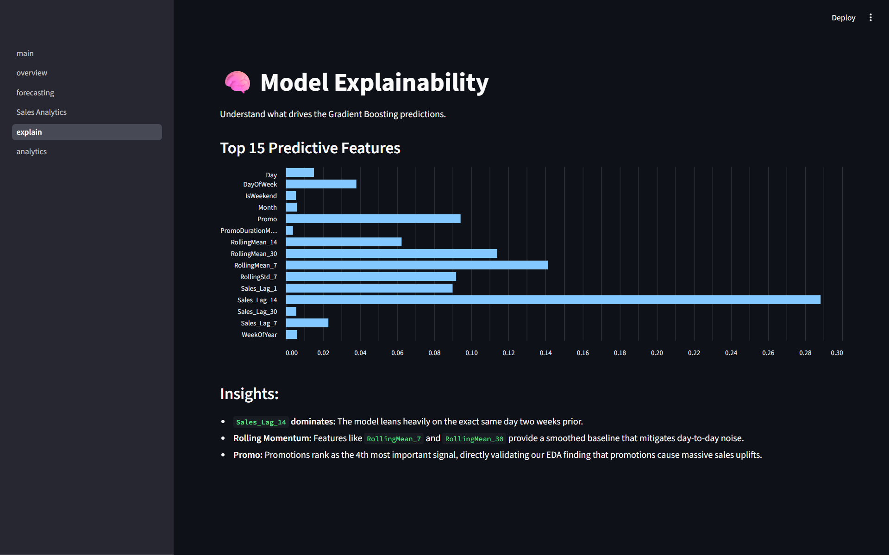

# 📈 Rossmann Store Sales Forecasting

<div align="center">
  
  
  
  
</div>

<br/>

> **A custom-built Gradient Boosting predictive framework engineered from scratch without relying on standard ML libraries like `scikit-learn` or `xgboost`.**

---

## 🎯 Project Overview
This project presents a comprehensive machine learning pipeline designed to predict daily sales across 1,115 Rossmann drug stores. A unique constraint of this research was the utilization of a strict offline development environment. The entire predictive analytics framework—including data preprocessing, feature engineering, and modeling—was engineered from scratch utilizing the Python Standard Library.

---

## 📊 Dataset & Verified Metrics
The project utilizes the verified Rossmann Store Sales dataset. All anomalous or non-operational records were carefully cleaned prior to modeling.

- **Raw Records:** 1,017,209
- **Cleaned Target Records:** 844,392
- **Train Set Size:** 669,308
- **Hold-out Test Size:** 175,084

### 💡 Key Business Findings
- **Promotional Power:** Active promotions drive a massive **38.77% uplift** in daily sales universally.
- **Top Predictor:** The most important feature for predicting future sales is **`Sales_Lag_14`** (Sales from exactly two weeks prior), capturing bi-weekly cyclic behavior.

---

## 🤖 Custom Machine Learning Architecture
Three models were evaluated. The Random Forest and Gradient Boosting regressors were built from algorithmic first principles in pure Python, bypassing traditional libraries to demonstrate a deep understanding of ensemble tree mechanics.

| Model | Mean Absolute Error (MAE) | Root Mean Squared Error (RMSE) | R-squared (R²) |
| :--- | :--- | :--- | :--- |
| **Historical Baseline** | 1,225.53 | 1,653.96 | 0.7070 |
| **Random Forest** | 932.49 | 1,338.22 | 0.8082 |
| **Gradient Boosting** | **745.88** | **1,091.35** | **0.8724** |

---

## 🚀 Demo
The project includes a complete Streamlit dashboard. Screenshots and source code are available in this repository.

---

## 🖥️ Interactive Dashboard Showcase

The predictive models and EDA insights have been fully operationalized into an enterprise-grade Streamlit application. The dashboard runs instantaneously by leveraging an optimized JSON data architecture.

<div align="center">

### 1. Executive Overview

<br/><i>High-level performance metrics and executive summaries.</i><br/><br/>

### 2. Sales Analytics

<br/><i>In-depth analysis of store types, assortments, and competition distance.</i><br/><br/>

### 3. Promotion Insights

<br/><i>Visualizing the massive 38.77% sales lift generated by promotional events.</i><br/><br/>

### 4. Forecast Center

<br/><i>Interactive simulation engine projecting future sales using an autoregressive loop.</i><br/><br/>

### 5. Model Insights

<br/><i>Feature importance breakdown explaining the core drivers of the GBM predictions.</i><br/><br/>

</div>

---

## 🛠️ Technology Stack
* **Language:** Pure Python (No `pandas`, `scikit-learn`, `xgboost` in the ML backend)
* **Frontend:** Streamlit 
* **Data Visualization:** Plotly
* **Data Pipeline:** Pre-aggregated JSON payload builder for maximum frontend performance

---

## 📂 Folder Structure
```text
Sales-Forecasting-Analysis/
├── data/                  # Source CSVs and aggregated dashboard JSON
├── docs/                  # Project PPT and architecture diagrams
├── notebooks/             # Step-by-step Jupyter notebooks (Cleaning to Modeling)
├── reports/               # Final academic report
├── screenshots/           # Application visuals
├── streamlit_app/         # Multi-page interactive frontend
│   ├── main.py
│   └── pages/             # Individual dashboard views
└── [Python Scripts]       # Core ML backend (Data loading, Tree Building, Ensembling)
```

---

## 🚀 How to Run Locally

1. **Clone the Repository**
   ```bash
   git clone https://github.com/Simply-Coder-start/Sales-Forecasting-Analysis.git
   cd Sales-Forecasting-Analysis
   ```

2. **Install Dependencies**
   *(Note: The core ML engine uses pure Python, but the dashboard requires Streamlit & Plotly)*
   ```bash
   pip install -r requirements.txt
   ```

3. **Launch the Dashboard**
   ```bash
   streamlit run streamlit_app/main.py
   ```

---

## 🔮 Future Improvements
- Implement automated hyperparameter tuning for the custom GBM architecture.
- Integrate external weather datasets to further explain regional sales variances.
- Deploy the Streamlit application to a cloud provider (e.g., AWS EC2 or Streamlit Community Cloud) for global stakeholder access.

---

## 👨‍💻 Author Section
Developed as a Final-Year BCA Project.
Built with ❤️ and pure Python.
