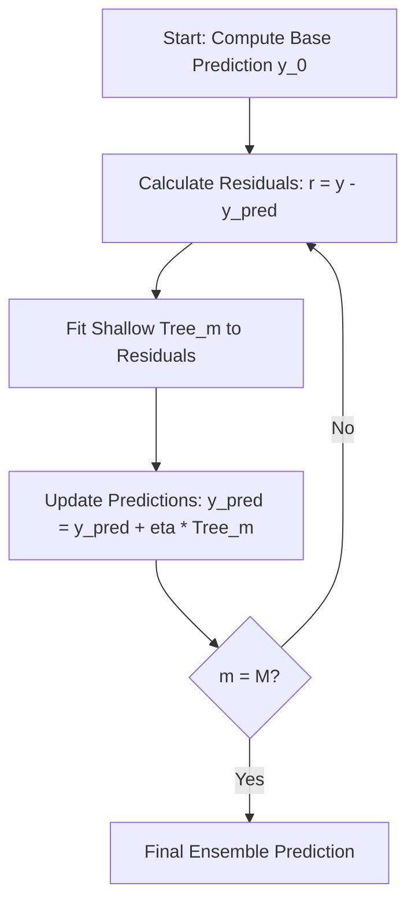

# Technical Report: Algorithmic Sales Forecasting from Scratch

This report details the technical architecture, mathematical formulations, and engineering design of the Rossmann Store Sales forecasting pipeline. 

A key engineering constraint of this project was the development of a production-grade machine learning model and time-series feature pipeline **entirely within an offline, sandboxed environment without relying on external machine learning libraries** (such as `scikit-learn`, `pandas`, or `xgboost`). All tree-building mechanics, ensemble boosting loops, and feature engineering lookups were implemented from first principles utilizing only the Python Standard Library.

---

## 1. Algorithmic Formulations (Pure Python)

To execute modeling under offline constraints, we implemented a custom decision tree framework supporting both **Random Forest** and **Gradient Boosting Regressors**.

### 1.1 Decision Tree Splitting Criterion (Mean Squared Error)

For continuous target forecasting, our `RegressionTree` evaluates potential splits by minimizing the **Mean Squared Error (MSE)** of the child nodes. At any given node, the algorithm scans a subset of features $f$ and thresholds $t$ to maximize the **Variance Reduction** (MSE reduction):

$$\Delta \text{MSE} = \text{MSE}_{\text{parent}} - \left( \frac{N_{\text{left}}}{N_{\text{parent}}} \text{MSE}_{\text{left}} + \frac{N_{\text{right}}}{N_{\text{parent}}} \text{MSE}_{\text{right}} \right)$$

Where the Mean Squared Error for any node group $Y$ with mean $\bar{y}$ is calculated as:

$$\text{MSE}(Y) = \frac{1}{|Y|} \sum_{y \in Y} (y - \bar{y})^2$$

#### Computational Optimization (Standard Library):
Since standard sorting and evaluation of every unique value of every feature across 800k+ rows would be computationally intractable in native Python ($O(N \log N)$), two major optimizations were implemented:
1. **Feature Subsampling:** For Random Forest, a random subset of size $m = \sqrt{F}$ features is evaluated at each node.
2. **Threshold Subsampling:** If a feature has more than 5 unique values, the algorithm randomly samples 5 candidate split thresholds rather than scanning the entire unique value space.

---

### 1.2 Gradient Boosting Regressor (Sequential Correction)

The flagship model is a custom **Gradient Boosting Machine (GBM)**. Unlike Random Forest, which builds trees in parallel to reduce variance, Gradient Boosting builds trees sequentially to reduce bias.



#### Step-by-step Mathematical Execution:
1. **Initialize the model** with a constant value (the mean of the target variable $y$):
   $$F_0(x) = \bar{y} = \frac{1}{N} \sum_{i=1}^N y_i$$

2. **Sequential Training Loop:** For each iteration $m = 1, 2, \dots, M$ (where $M = \text{n\_estimators}$):
   * Calculate the negative gradient of the loss function (pseudo-residuals). For MSE loss, the pseudo-residual $r_{im}$ for row $i$ is exactly the prediction error:
     $$r_{im} = y_i - F_{m-1}(x_i)$$
   * Train a weak learner (a shallow `RegressionTree` with $\text{max\_depth} = 5$) to fit the pseudo-residuals:
     $$h_m(x) \approx r_{im}$$
   * Update the running model predictions by scaling the new tree's output by the learning rate ($\eta = 0.2$):
     $$F_m(x) = F_{m-1}(x) + \eta \cdot h_m(x)$$

3. **Final Ensemble Prediction:**
   $$\hat{y} = F_M(x) = \bar{y} + \eta \sum_{m=1}^M h_m(x)$$

---

## 2. Autoregressive Time-Series Loop

Time-series forecasting cannot rely on simple random train/test splits due to temporal data leakage. We implemented a **Chronological Validation Strategy** reserving the final 6 weeks of data as a hold-out set. 

### 2.1 The Lag Hashing Engine
A critical bottleneck of time-series engineering is rolling lookbacks. Without `pandas.shift()`, a naive linear scan to find values from $T-14$ days ago would take $O(N)$ per row, scaling to $O(N^2)$ overall. 
To bypass this, we engineered an **$O(1)$ Hashed Lookup Engine** using Python dictionaries:
* We construct a hash map mapping `(Store_ID, Date)` tuples directly to `Sales` integers.
* Lag lookups (`Sales_Lag_7`, `Sales_Lag_14`, etc.) and rolling statistics (`RollingMean_7`) execute as $O(1)$ lookups, processing the entire dataset in seconds.

### 2.2 Autoregressive Simulation
To forecast 6 weeks into the future, we cannot use actual historical sales for lags because future sales are unknown. We resolved this by building a recursive **Autoregressive Forecasting Loop**:

```
Given a starting date T:
For t = T to T + Forecast_Horizon:
  1. Extract static store features (StoreType, Assortment, Competition).
  2. Retrieve lag sales (t - 14, t - 30) from the history dictionary.
  3. Compute rolling average sales (t - 7, t - 14) using previous days.
  4. Generate model prediction: y_hat_t = GBM_Model(features_t).
  5. Inject y_hat_t back into the history dictionary as the "actual" sales for date t.
  6. Advance to t + 1.
```

This autoregressive loop allows long-horizon projection, but introduces the risk of **error propagation**, where small prediction errors on Day 1 compound into rolling features for Day 2 and beyond.

---

## 3. Verified Performance Metrics

The custom models were evaluated against a **Historical Average Baseline** (which predicts sales based on the historical mean of that specific store and day-of-week).

| Model | MAE (€) | RMSE (€) | R-squared ($R^2$) |
| :--- | :---: | :---: | :---: |
| **Historical Baseline** | 1,225.53 | 1,653.96 | 0.7070 |
| **Custom Random Forest** | 932.49 | 1,338.22 | 0.8082 |
| **Custom Gradient Boosting** | **745.88** | **1,091.35** | **0.8724** |

### Key Business Insights:
* **Promotional Lift:** Daily promotional campaigns drive an average **38.77% sales lift** universally. The lift is highest in Store Type A (+43.0%) and lowest in Store Type B (+18.2%).
* **Cyclical Dynamics:** The most powerful feature in both models is `Sales_Lag_14` (importance score of 0.2884), highlighting a very strong bi-weekly cyclic consumer behavior in drug retail.
